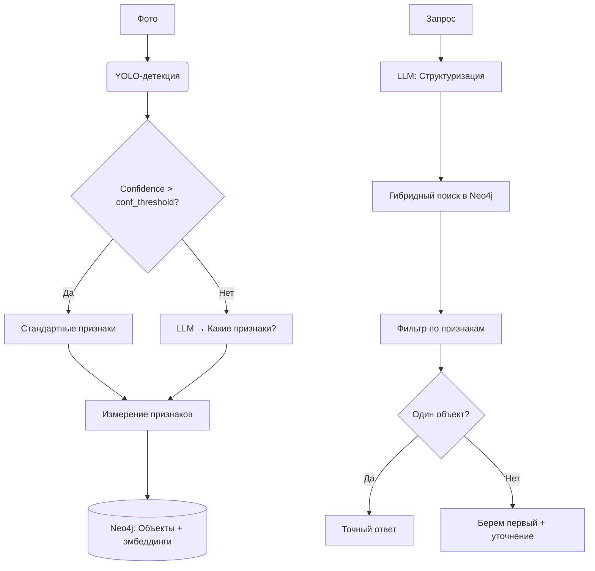

# Проект с интеграцией RAG.
В целях знакомства с RAG и практики в  
работе с промптами, придумал следущий проект, который в ближайшее время планирую реализовать:

### Идея проекта:
В модель загружаются фотографии комнаты. (поверхность стола, комода, подоконника, ..)  
Модель с помощью YOLO детектирует предметы из **заранее подготовленного конечного** множества классов,
описанных в config/classes.json
(Для MVP. Потом можно добавить автоматическое расширение классов с помощью VLM)
В классах предметов заранее прописаны свойства, необходимые для определения и методы их определения.
Базовые методы определения полагаются более быстрыми,
но при низком confidence идет обращение к VLM для уточнения свойств или класса объекта.

Информация об объектах сохраняется в графовую БД с эмбеддингами (Neo4j 5.x).

Выполнение запроса я пока вижу следующим образом:
1. Подаем запрос в (пока) текстовом виде "скажи мне, где синяя штука для питья"
2. Он попадает на вход к LLM, которая искомый элемент конвертирует в эмбеддинг
3. В векторной БД находятся наиболее вероятные элементы, передаются в модель
4. После чего на вход LLM подается промпт с графовой базой данных, id найденных объектов и исходным запросом
5. На основании этих данных LLM генерирует ответ.



### Структура проекта:
```
RAG/  
├── config/  
│   ├── classes.json/ # описание классов объектов, определяемых моделью.  
│   │                   Такой формат посчитал наиболее удобным к расширению  
│   ├── relations.json/ # описание отношений объектов, определяемых моделью.  
│   │                   TODO: использование методов по названию  
│   ├── prompts.json/ # Описание промптов для генерации.  
│  
├── detectors/          # Содержит функционал определения параметров без VLM  
├── images/             # Содержит тестовые изображения  
├── models/             # Содержит модели в формате .pt  
├── src/  
│   ├── scene_object.py # dataclass объектов сцены  
│   ├── model_loaders.py# Загрузчики моделей  
│   ├── graphit.py      # Класс, осуществляющий детекцию объектов и их отношений  
│   ├── prompt_manager.py   # Класс, выполняющий генерацию промптов для запросов к LLM   
│  
├── tests/              # Содержит тесты. test_detection.py - стоит пока запускать  
├── requirements.txt    # Список используемых библиотек  
├── README.md           # <-- вы сейчас здесь     
```


### TODO:
- Прикрутить Neo4j (в процессе, процесс в репозитории github.com/Naketsmall/Neo4jTrain)
- Добавить класс работы с БД объектов и извлечением свойств, к которым можем сделать запросы (get_neighbours(), get_feature("color"), ...)  
- Добавить промпт, получающий список функций вышеупомянутого класса, и запрос пользователя, для декомпозиции действий с помощью LLM.  
- Добавить систему для выполнения декомпозированных функций 


### P.S.
Выглядит так, будто я не могу развернуть VLM локально в силу ограниченных
вычислительных мощностей моего ноутбука. И у меня возникает идея развернуть API в Colab.  
Наверное пока это будет просто вывод в консоль с просьбой описать, что на картинке:)))

##### Диаграмма свойств классов внутри Neo4j


### ⚠️ Условия использования  
Этот проект использует **GigaChat API** от [Sber](https://developers.sber.ru/docs/ru/gigachat/api/overview), который:  
- Предназначен **только для некоммерческого использования**.  
- Запрещено использовать API в коммерческих продуктах без согласования с Sber.  
