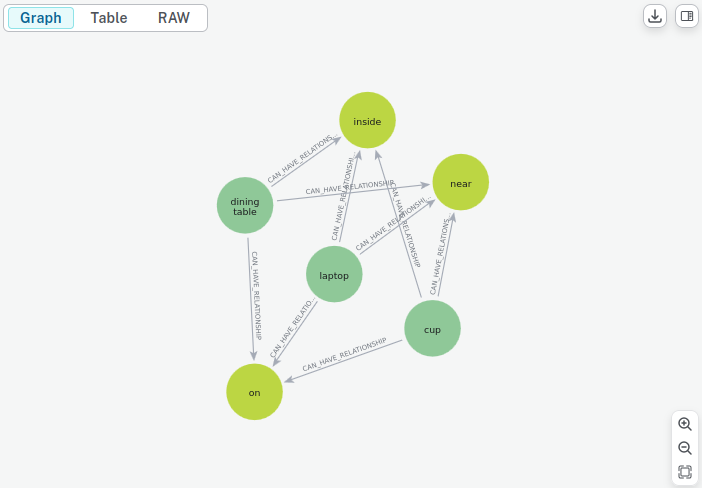
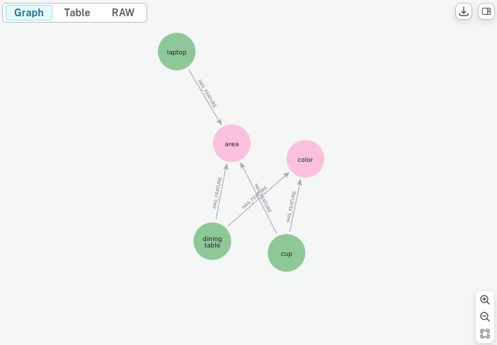

# Проект с интеграцией RAG.

### Идея проекта:
- Составление графа сцены по фотографиям
- Поиск предметов, среди составленных, по естественноязыковым описаниям ("синяя штука для питья")
- Визуализация сцен через графы знаний
- Расширяемая база объектов (добавление классов без переписывания кода)

### Алгоритм реализации:
#### Построение графа сцены
В модель загружаются фотографии комнаты. (поверхность стола, комода, подоконника, ..)  
Модель с помощью YOLO детектирует предметы из **заранее подготовленного конечного** множества классов,
описанных в config/classes.json
(Для MVP. Потом можно добавить автоматическое расширение классов с помощью VLM)
В классах предметов заранее прописаны свойства, необходимые для определения и методы их определения.
Базовые методы определения полагаются более быстрыми,
но при низком confidence планируется реализовать обращение к VLM для уточнения свойств.

#### Получение информации о предметах
После загрузки фотографий, модель может отвечать на вопросы о детектированных предметах и их свойствах.
Пользователь в произвольной форме спрашивает: "Где синяя штука для питья"
Дальше его запрос внутри промпта, аггрегирующего список классов и отношений поступает на вход LLM
(пока, в силу доступности API, Sber GigaChat. Но из версий только Gigachat-2-Max нормально выполняет запросы, остальные несут околесицу.)  
После чего, LLM возвращает массив предполагаемых классов+признаков для поиска.
Составляются эмбеддинги указанных объектов и запросы отправляются к Neo4j,
которая, будучи графовой БД, поддерживает векторные индексы.  
Neo4j возвращает KNN, они передаются на вход LLM в промпте, содержащим запрос пользователя, LLM возвращает наиболее вероятный элемент и описание.  
В случае с вышеуказанным запросом это, к примеру, будет 
```json
{
  "class": "cup_3",
  "features": {
    "color": "blue"
  },
  "neighbours": {
    "on": [
      "table_17"
    ],
    "near": [
      "cup_25",
      "laptop_36"
    ]
  }
}
```
(хотя в целом, форматы передачи данных пока уточняются).

### Реализованный тест уже есть
В тесте:
- Детекция объектов, признаков и их отношений
- Генерация промптов и обращение к LLM
- Пока этап RAG пропущен, сейчас работаю над ним.
- Тестовый скрипт: [test_local_db_with_llm.py](tests/test_local_db_with_llm.py)  
- Ответ LLM [TLDBWLLM_2_Max.txt](llm_responses/TLDBWLLM_2_Max.txt)

### Реализовано:
#### Обнаружение и хранение объектов
1. Описание классов объектов сцены с использованием @dataclass: [scene_object.py](src/scene_object.py)  
и сцены: [graphit.py](src/graphit.py)
2. Удобный механизм добавления новых классов, признаков и отношений просто засчет изменения [classes.json](config/classes.json) и [relations.json](config/relations.json)
 +добавление файла feature_detector в [detectors](detectors) (Достаточно хороший уровень абстракции, имхо. Прекрасно для расширения функционала программы)
3. Детекция объектов с помощью YOLO [graphit.py](src/graphit.py)   
и тест: [test_detection.py](tests/test_detection.py)
4. Различные детекторы признаков и отношений [detectors](detectors)

#### Взаимодействие с LLM
5. Промпт-менеджер для генерации запросов к LLM: [prompt_manager.py](src/prompt_manager.py) и тест: [test_prompt_manager.py](tests/test_prompt_manager.py)
6. Типа интегральный тест: [test_local_db_with_llm.py](tests/test_local_db_with_llm.py),  
результат: [TLDBWLLM_2_Max.txt](llm_responses/TLDBWLLM_2_Max.txt) 
[models](models)
#### Хранение в БД и взаимодействие
7. sh-скрипт для запуска контейнера [run_container.sh](docker_scripts/run_container.sh)
8. Генерация графовой БД Neo4j с отношениями и признаками (в процессе, фоточки ниже) [graph_manager.py](src/graph_manager.py)


### Структура проекта:
```
RAG/  
├── config/  
│   ├── classes.json/ # описание классов объектов, определяемых моделью.  
│   │                   Такой формат посчитал наиболее удобным к расширению  
│   ├── relations.json/ # описание отношений объектов, определяемых моделью.  
│   │                   TODO: использование методов по названию  
│   ├── prompts.json/ # Описание промптов для генерации.  
│  
├── detectors/          # Содержит функционал определения параметров без VLM  
├── images/             # Содержит тестовые изображения  
├── models/             # Содержит модели в формате .pt  
├── src/  
│   ├── scene_object.py # dataclass объектов сцены  
│   ├── model_loaders.py# Загрузчики моделей  
│   ├── graphit.py      # Класс, осуществляющий детекцию объектов и их отношений  
│   ├── prompt_manager.py   # Класс, выполняющий генерацию промптов для запросов к LLM  
│   ├── graph_manager.py   # Класс, взаимодействующий с графовой БД  
│  
├── docker_scripts/     # Тут лежит .sh скрипт для запуска контейнерв с БД  
├── tests/              # Содержит тесты модулей/классов программы  
├── requirements.txt    # Список используемых библиотек  
├── README.md           # <-- вы сейчас здесь     
```


### P.S.
Выглядит так, будто я не могу развернуть VLM локально в силу ограниченных
вычислительных мощностей моего ноутбука. И у меня возникает идея развернуть API в Colab.  
Наверное пока это будет просто вывод в консоль с просьбой описать, что на картинке:)))

##### Диаграммы отношений и свойств классов внутри Neo4j



### ⚠️ Условия использования  
Этот проект использует **GigaChat API** от [Sber](https://developers.sber.ru/docs/ru/gigachat/api/overview), который:  
- Предназначен **только для некоммерческого использования**.  
- Запрещено использовать API в коммерческих продуктах без согласования с Sber.  
